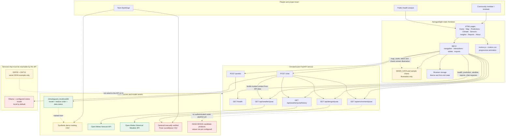
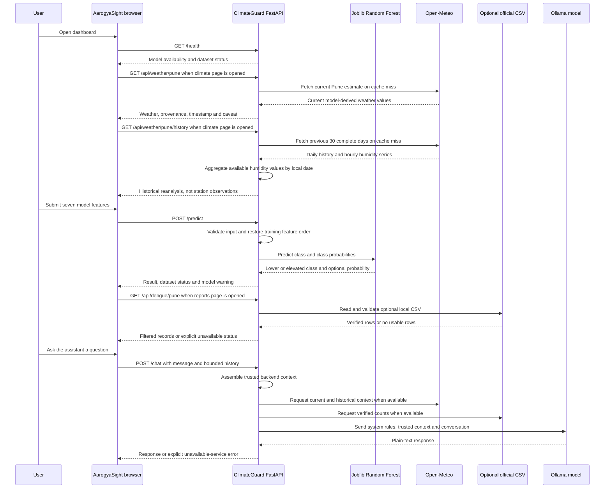
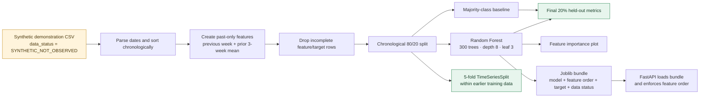

# AarogyaSight | ClimateGuard

**Fusion 2026 Hackathon project by Team Byteforge**

AarogyaSight is a climate-and-public-health dashboard prototype. It brings together a multi-page browser interface, a FastAPI service, an experimental dengue-risk classifier, selected Pune weather feeds, a locally hosted AI assistant, and an ESP32/DHT11 serial-output example.

The project is designed to demonstrate how environmental context and public-health reporting might be brought into one place. It is **not** a validated outbreak-forecasting system, a live IoT deployment, or a medical product. The distinction between demonstration content, external model estimates, verified reports, and unavailable data is an important part of the design.

## Contents

- [Project at a glance](#project-at-a-glance)
- [System architecture](#system-architecture)
- [Repository layout](#repository-layout)
- [Dashboard pages and user journey](#dashboard-pages-and-user-journey)
- [Technical approach](#technical-approach)
- [Data, trust, and limitations](#data-trust-and-limitations)
- [HTTP API](#http-api)
- [Run locally](#run-locally)
- [Deploy the frontend to Vercel](#deploy-the-frontend-to-vercel)
- [Model training and evaluation](#model-training-and-evaluation)
- [IoT prototype](#iot-prototype)
- [Accessibility and interface behavior](#accessibility-and-interface-behavior)
- [Potential next steps](#potential-next-steps)
- [Credits and data sources](#credits-and-data-sources)
- [Team](#team)

## Project at a glance

| Area | Current implementation |
|---|---|
| Product | AarogyaSight: a static, multi-page HTML/CSS/JavaScript dashboard |
| API | ClimateGuard: a Python FastAPI application |
| Prediction model | Scikit-learn Random Forest classifier loaded from a local Joblib artifact |
| Model training data | Synthetic demonstration records explicitly marked `SYNTHETIC_NOT_OBSERVED` |
| Weather | Open-Meteo current model estimates and historical weather reanalysis for Pune |
| Dengue surveillance | Optional, manually reviewed official CSV; unavailable when no verified file is installed |
| Satellite indicators | Endpoint and provenance metadata are present; actual Pune NDVI/NDWI values are unavailable |
| Assistant | Ollama-hosted local Llama model accessed by the API; not bundled with the static website |
| Hardware example | ESP32 sketch reads a DHT11 and emits temperature/humidity JSON over serial |
| Frontend hosting | Static hosting; Vercel can serve the frontend independently |
| Backend hosting | Separate Python-capable service required for the API; chat additionally requires reachable Ollama |

## System architecture

The system has distinct data paths. In particular, the demo risk map and alert examples are not outputs of the classifier or the physical sensor sketch.



### Request and data flows



## Repository layout

```text
.
├── README.md
├── frontend/
│   └── aarogyasight/
│       ├── index.html
│       ├── disease-map.html
│       ├── predictions.html
│       ├── climate-data.html
│       ├── iot-sensors.html
│       ├── insights.html
│       ├── reports.html
│       ├── about.html
│       ├── styles.css
│       ├── motion.css
│       ├── app.js
│       ├── motion.js
│       └── assets/
├── ClimateGuard/
│   ├── main.py
│   ├── train_model.py
│   ├── predict.py
│   ├── climateguard_model.joblib
│   ├── climateguard_synthetic_demo_training.csv
│   ├── climateguard_cv_results.csv
│   ├── feature_importance.png
│   └── data/
│       └── README.md
└── IOT/
    └── ESP32 code/
        └── DHT32.txt
```

The repository may also contain local development environments or package-install directories. They are not inputs to the static Vercel build; do not upload a virtual environment or `node_modules` as part of a deployment artifact.

## Dashboard pages and user journey

| Page | Purpose | Data status |
|---|---|---|
| `index.html` | Dashboard landing page with summary cards, map, charts, and sample alerts | The map, sample alerts, and summary risk content are illustrative frontend data |
| `disease-map.html` | Explore a stylized India map and select the demo districts | Map risk shading is based on frontend sample values and disease adjustments |
| `predictions.html` | Enter model features and submit them to `POST /predict` | Uses the API model when configured; response includes its synthetic-data warning |
| `climate-data.html` | View current Pune weather and recent historical climate | Open-Meteo model estimate/reanalysis, not ground-station measurements |
| `iot-sensors.html` | Show the sensor dashboard concept | The included firmware example is not connected to this page or API |
| `insights.html` | Present explanatory and comparative dashboard content | Charts and insights are demonstration content unless specifically identified otherwise |
| `reports.html` | Show and export official Pune dengue records | Requires a verified CSV; empty or absent data is shown as unavailable |
| `about.html` | Explain the product concept and its context | Informational page |

### Demonstration map behavior

The dashboard's `DEMO_DATA` currently contains four example locations. The browser applies simple risk-level presentation rules to those example scores:

| Display score | Frontend label |
|---:|---|
| \(r \ge 60\) | High Risk |
| \(40 \le r < 60\) | Moderate Risk |
| \(r < 40\) | Low Risk |

Changing the disease applies a fixed display adjustment to the sample score. It does **not** retrain or query the Random Forest. These thresholds and values are UI behavior, not a public-health risk scale.

## Technical approach

### Frontend

- Plain HTML pages with shared CSS and JavaScript; no frontend framework, package installation, or compilation step is required.
- `app.js` wires navigation controls, map and district selection, disease tabs, charts, notifications, search, table rendering, CSV downloads, theme preference, and the backend-backed climate/report/prediction/chat interactions.
- `motion.js` and `motion.css` add optional interface animation. The base pages remain static HTML/CSS/JavaScript.
- The website is served over HTTP in development; opening HTML files with `file://` can interfere with browser requests and is not the documented workflow.
- Browser theme preference is saved in `localStorage`; first-visit animation state is saved in `sessionStorage`.

### API and service boundaries

- FastAPI validates request data with Pydantic, loads the serialized model at process startup, and exposes documented routes under `/docs`.
- Model features are reordered to match the order saved with the training artifact before prediction.
- Weather requests are made server-side; API responses include source, retrieval time, data type, and limitations.
- Weather response caches are in-process dictionaries. They are useful for a single development process, but are not a shared/distributed cache across replicas or serverless invocations.
- The chat endpoint builds a trusted context from API data before calling Ollama. It does not make the browser an authority for live data.
- The default Ollama URL is local (`http://127.0.0.1:11434`). A deployed API cannot reach a developer's laptop through that address.

### Model features

`POST /predict` accepts the following seven inputs:

| Feature | Meaning | API validation |
|---|---|---|
| `cases_previous_week` | Case count from the previous weekly period | Non-negative |
| `cases_3week_average` | Mean cases across the three preceding weekly periods | Non-negative |
| `rain_previous_week` | Previous-week rainfall in millimetres | Non-negative |
| `temperature_previous_week` | Previous-week temperature in degrees Celsius | Any numeric value |
| `humidity_previous_week` | Previous-week relative humidity in percent | 0–100 |
| `ndvi` | Normalized Difference Vegetation Index input | -1–1 |
| `surface_water_index` | Surface-water-index input | 0–1 |

The training script sorts rows chronologically and constructs its lag features using prior rows. For a weekly series \(x_t\), the previous-period value and three-period trailing average are:

$$
x_{t-1} = \text{previous period value}
$$

$$
\overline{x}_{t-1:t-3} = \frac{x_{t-1} + x_{t-2} + x_{t-3}}{3}
$$

The classifier target is the dataset column `target_next_week_elevated`. The training script uses that supplied target; it does not derive a medically validated outbreak threshold from raw case counts.

### Random Forest output

The training script configures 300 trees, maximum depth 8, minimum leaf size 3, balanced class weights, random seed 42, and parallel tree fitting. If tree \(m\) predicts class \(h_m(x)\), the forest class prediction is the majority vote:

$$
\hat{y}(x) = \text{mode}\{h_1(x), h_2(x), \ldots, h_{300}(x)\}
$$

When the estimator provides class probabilities, the API returns the probability for class \(1\) (elevated) as `elevated_probability`. That probability is a model output, not a calibrated or validated real-world disease probability.

### Spectral index equations

The API documents candidate satellite-derived indices but does not currently provide extracted Pune raster values. For reference, common definitions are:

$$
\text{NDVI} = \frac{\text{NIR} - \text{Red}}
{\text{NIR} + \text{Red}}
$$

$$
\text{NDWI} = \frac{\text{Green} - \text{NIR}}
{\text{Green} + \text{NIR}}
$$

These ratios require properly scaled surface reflectance, quality/cloud screening, geospatial boundaries, and time alignment. NDWI is not itself a direct measurement of water area. The endpoint returns `null` indicators and an unavailable status rather than inventing values.

## Data, trust, and limitations

### What is real, illustrative, and not yet connected

| Source or view | What it represents | What it does not establish |
|---|---|---|
| Open-Meteo current endpoint | Provider model estimate for the Pune coordinates; includes current temperature, relative humidity, and precipitation interval | Not a Pune weather-station observation and not a fixed-frequency IoT feed |
| Open-Meteo archive endpoint | Historical model reanalysis over the previous 30 complete days; daily temperature/rain and daily means aggregated from available hourly humidity | Not measured station history; recent dates may be revised or unavailable |
| Synthetic training CSV | Generated demonstration rows marked `SYNTHETIC_NOT_OBSERVED` | Not real dengue surveillance, weather, satellite, or population data |
| Frontend map, alerts, charts, profile | Illustrative UI content in `app.js` and the HTML pages | Not live regional surveillance, connected user accounts, sensor readings, or model predictions |
| Optional dengue CSV | Official Pune district or municipal records, after a human verifies the published source | Not available by default; Maharashtra-level totals must not be relabelled as Pune records |
| Environment endpoint | Candidate MODIS product metadata and the required processing caveats | No authenticated/extracted NDVI or surface-water value is configured |
| ESP32/DHT11 sketch | Example of reading local temperature and humidity and printing JSON over serial | No network transport, ingestion service, persistence, or dashboard connection |

### Official dengue data import

The API looks for `ClimateGuard/data/pune_dengue_cases.csv`. The file is intentionally absent unless a verified official dataset is imported. The required header is:

```csv
period_start,period_end,area,area_level,cases,source,source_url,published_at,status
```

Dates use `YYYY-MM-DD`; cases must be non-negative whole numbers; `source_url` must be an HTTPS address on an official `.gov.in` domain; and status must be `reported`, `provisional`, `incomplete`, or `aggregated`. The endpoint returns only Pune District or Pune Municipal Corporation/City records at the expected geographic levels. It does not fill missing periods, infer counts, or convert state totals into city data.

Follow the detailed verification and import notes in [`ClimateGuard/data/README.md`](ClimateGuard/data/README.md).

### Safety and intended use

- Model results are experimental and trained on synthetic data. They must not be used to make operational outbreak, treatment, or resource-allocation decisions.
- The dashboard is educational and demonstrative; it is not medical advice, a diagnosis tool, or a replacement for public-health authorities.
- The assistant is instructed not to diagnose or prescribe and to direct urgent or severe symptoms to appropriate medical care.
- Do not present estimates, reanalysis, sample data, or unavailable values as direct observations.

## HTTP API

Run the backend to use these routes. FastAPI's interactive OpenAPI interface is available at `/docs`.

| Method | Path | Purpose |
|---|---|---|
| `GET` | `/` | API welcome response and docs link |
| `GET` | `/health` | Model load state, dataset status, and load error if any |
| `POST` | `/predict` | Validate seven features and return class, risk label, optional elevated probability, and warning |
| `GET` | `/api/weather/pune` | Current Pune model estimate; in-process cache TTL is 15 minutes |
| `GET` | `/api/weather/pune/history` | Previous 30 complete days of Pune model reanalysis; in-process cache TTL is 6 hours |
| `GET` | `/api/dengue/pune` | Validated official CSV rows, or an explicit unavailable response |
| `GET` | `/api/environment/pune` | Explicit unavailable status and candidate satellite-product information |
| `POST` | `/chat` | Bounded conversation request answered by configured Ollama model using trusted backend context |

Prediction request example:

```json
{
  "cases_previous_week": 12,
  "cases_3week_average": 10.5,
  "rain_previous_week": 42.0,
  "temperature_previous_week": 27.4,
  "humidity_previous_week": 68.0,
  "ndvi": 0.31,
  "surface_water_index": 0.22
}
```

The values above are an **illustrative request shape**, not a recommended operational input or an observed Pune record.

### Prediction-evaluation measures

The training script prints held-out accuracy, balanced accuracy, precision, recall, F1, a confusion matrix, and a classification report, and compares against a majority-class baseline. For positive/elevated class \(1\):

$$
\text{Precision} = \frac{TP}{TP + FP}
\qquad
\text{Recall} = \frac{TP}{TP + FN}
$$

$$
F_1 = 2 \cdot
\frac{\text{Precision}\cdot\text{Recall}}
{\text{Precision}+\text{Recall}}
$$

Balanced accuracy averages recall over the classes, so it is less dominated by the most frequent class than plain accuracy. These metrics describe performance on synthetic example records only and do not establish predictive validity on real surveillance data.

## Run locally

### 1. Start the frontend

From the frontend directory, serve the static files over HTTP:

```powershell
cd frontend\aarogyasight
python -m http.server 5500 --bind 127.0.0.1
```

Open `http://127.0.0.1:5500/` in a browser.

### 2. Start the API

Use Python 3.10 or newer and install the backend libraries in a virtual environment. From `ClimateGuard`, install the runtime dependencies:

```powershell
cd ClimateGuard
python -m pip install fastapi "uvicorn[standard]" pandas scikit-learn joblib httpx
python -m uvicorn main:app --reload --host 127.0.0.1 --port 8002
```

The application expects `ClimateGuard/climateguard_model.joblib` to exist and be loadable by the installed Joblib/Scikit-learn versions. Check `http://127.0.0.1:8002/health` and `http://127.0.0.1:8002/docs`.

The browser client defaults to `http://127.0.0.1:8002`. To point it at another API, define `window.CLIMATEGUARD_API_BASE` **before** the page loads `app.js`, for example:

```html
<script>
  window.CLIMATEGUARD_API_BASE = "https://your-api.example.com";
</script>
<script src="app.js"></script>
```

Configure the production API's CORS allowlist for the exact deployed frontend origin. The current backend allowlist is intended for localhost development.

### 3. Optional local AI assistant

The chat endpoint requires an Ollama service and the configured model. By default, the backend expects Ollama at `http://127.0.0.1:11434` with model `llama3:latest`. `OLLAMA_URL` and `OLLAMA_MODEL` can be supplied as backend environment variables. Chat requests fail with an explicit service-unavailable response when Ollama or the configured model is unavailable; the backend does not download a missing model automatically.

## Deploy the frontend to Vercel

The frontend is plain static HTML, CSS, JavaScript, and local assets. **Deploy only `frontend/aarogyasight` as the Vercel project root**. The Python API, model, and Ollama service are separate runtime services and are not made deployable by publishing the static pages.

### Vercel project settings

1. Import the repository into Vercel, or upload the project source through the Vercel dashboard.
2. Set **Root Directory** to `frontend/aarogyasight`.
3. Use the **Other** framework preset if Vercel asks for a framework.
4. Leave the **Build Command** empty; there is no frontend build step.
5. Set **Output Directory** to `.` (the selected project root), if the deployment UI requires an output directory.
6. Deploy. `index.html` is the site's entry page, and the other `.html` pages are linked as static assets.

Alternatively, from the repository root with the Vercel CLI:

```powershell
vercel --cwd frontend/aarogyasight
```

### Connect a deployed API

The deployed static pages cannot call the development-only `127.0.0.1` API from a visitor's browser. To enable backend-backed features:

1. Deploy ClimateGuard to a separate host that supports the Python dependencies, the model artifact, and FastAPI's ASGI application.
2. Configure the API's CORS allowlist to include the exact Vercel production domain (and preview domains only if intentionally needed).
3. Set `window.CLIMATEGUARD_API_BASE` to the public HTTPS API origin before `app.js` loads. Static Vercel hosting does not automatically substitute this JavaScript setting from a server-only environment variable.
4. For chat, make sure the deployed API can securely reach an Ollama service running somewhere reachable from that host. The default localhost Ollama address only works when Ollama shares the API host.
5. Re-deploy and verify `/health`, `/api/weather/pune`, and the frontend's network requests. Check API logs and CORS headers if browser requests are blocked.

The static dashboard can still be deployed without the API, but backend-dependent climate, verified reports, model submission, and chat features will not work. The client should report unavailable services rather than imply local development services are publicly reachable.

## Model training and evaluation

From `ClimateGuard`, the training script reads the synthetic CSV, sorts rows by date, makes lagged features, holds out the final 20% chronologically, fits a majority-class baseline and a Random Forest, evaluates five time-ordered folds on the earlier training period, reports feature importance, and writes a serialized model bundle.



### Reproduce the saved model

From the `ClimateGuard` directory, after installing the training dependencies:

```powershell
python train_model.py
```

The script writes `climateguard_model.joblib`, `climateguard_cv_results.csv` (when cross-validation completes), and `feature_importance.png`. Training uses `matplotlib` for the plot; install it if needed:

```powershell
python -m pip install matplotlib
```

The serialized model uses Python object serialization. Load only model files from a trusted source, and keep the training and runtime Scikit-learn versions compatible.

## IoT prototype

`IOT/ESP32 code/DHT32.txt` is an ESP32 Arduino-style example configured for a DHT11 sensor on pin 4. It initializes the Adafruit DHT sensor libraries, samples every two seconds, and writes a JSON-shaped line over the serial connection when both measurements are valid:

```json
{"temperature":25.4,"humidity":61.2}
```

The sketch is a starting point for a sensor ingestion design, not an end-to-end feature. It does not connect to Wi-Fi, authenticate, publish MQTT/HTTP, buffer offline readings, attach a device identity/timestamp, or feed ClimateGuard. Likewise, the dashboard's IoT page is not receiving these serial values.

## Accessibility and interface behavior

- Semantic page navigation and accessible labels are used for many interactive controls.
- Map markers expose keyboard interaction in addition to pointer interaction.
- The motion layer honors `prefers-reduced-motion`.
- Light/dark theme preference is retained in browser storage.
- Google Fonts are loaded from an external provider; system fallbacks remain available if the network is offline.
- Data status, loading/errors, and unavailability are distinct from successful verified data; do not replace unavailable values with invented sample observations.

## Potential next steps

These are future work, not claims about the current implementation:

1. Replace demo map values with a governed, documented, geographically consistent surveillance dataset.
2. Collect representative observed training data, define an epidemiologically meaningful target with domain experts, and validate across time and geography before making any forecasting claim.
3. Calibrate probabilities and publish model cards, data lineage, uncertainty, monitoring, and retraining procedures.
4. Implement authenticated, quality-controlled geospatial extraction for Pune satellite products and preserve pixel/date/source metadata.
5. Design a secure sensor ingestion path (device identity, timestamps, transport, validation, persistence, monitoring) before calling any sensor feed live.
6. Deploy the API and AI service with explicit network boundaries, authentication/rate limits, secret management, CORS configuration, logging, and an operational data-retention policy.
7. Add automated frontend, API contract, model reproducibility, and deployment smoke tests.

## Credits and data sources

- Weather provider: [Open-Meteo Forecast API](https://open-meteo.com/en/docs) and [Historical Weather API](https://open-meteo.com/en/docs/historical-weather-api).
- Candidate satellite products documented by the API: [MOD13Q1.061 NDVI](https://www.earthdata.nasa.gov/data/catalog/lpcloud-mod13q1-061) and [MOD09A1.061 surface reflectance](https://www.earthdata.nasa.gov/data/catalog/lpcloud-mod09a1-061). Candidate metadata does not mean values are integrated.
- Official dengue records, if later imported, should retain a direct government source URL and publication metadata. Import requirements are documented in [`ClimateGuard/data/README.md`](ClimateGuard/data/README.md).
- Map boundary attribution and image provenance are described in [`frontend/aarogyasight/README.md`](frontend/aarogyasight/README.md).
- The DHT11 example depends on the Adafruit sensor libraries noted by its firmware includes.

## Team

**Byteforge** — Fusion 2026 Hackathon

---

**Responsible-use note:** AarogyaSight and ClimateGuard are hackathon demonstration software. No output should be used as a clinical diagnosis, a public-health alert, or a validated disease forecast.
